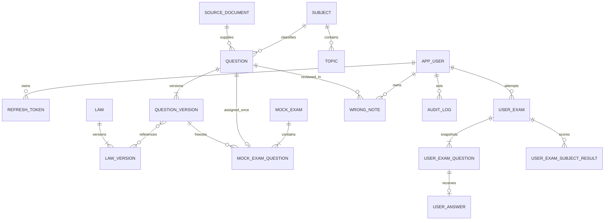

# ERD

## Aggregate boundaries

## Ownership rules
- `QUESTION`은 식별자와 검수 상태를, `QUESTION_VERSION`은 변경 불가능한 출제 내용을 가진다.
- `MOCK_EXAM`은 제1차 또는 제2차의 한 회차이며 `(exam_stage, set_no)`가 유일하다.
- `MOCK_EXAM_QUESTION.official_slot=true`인 `question_id`는 전체 공식 모의고사에서 한 번만 존재한다.
- `USER_EXAM_QUESTION`은 시작 시점의 시험 문항을 고정하며 답안은 이 테이블에 포함된 문항만 참조한다.
- `SOURCE_DOCUMENT`는 2016~2025 기출 원문과 이용조건 확인 이력을 보존한다.
- `AUDIT_LOG`는 append-only이며 승인, publish, 법령 변경, 권한 변경을 기록한다.

## Publish invariants
1. 단계에 속한 모든 시험과목 단위가 각각 정확히 40문항이어야 한다.
2. 모든 문항이 `APPROVED`이고 현재 버전과 편성 버전이 같아야 한다.
3. `normalized_hash`와 공식 `question_id`가 중복되지 않아야 한다.
4. `BLOCK` 유사도 쌍이 같은 공식 시험군에 포함되지 않아야 한다.
5. 참조 법령 버전이 시험의 `legal_reference_date`에 유효해야 한다.
6. 위 검증과 `official_slot`, `PUBLISHED` 변경은 한 transaction에서 수행한다.

## Cross-table validation
주제와 문항의 과목 일치, 시험 단계와 과목 단계 일치, 정확히 40문항 검증은
application service와 통합 테스트에서 검증한다. 중복과 참조 무결성은 DB unique/FK가 최종 방어선이다.
